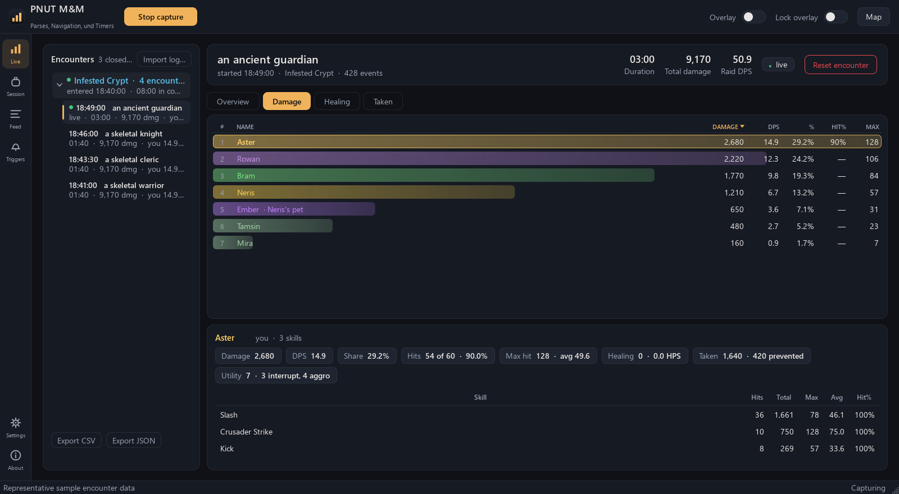
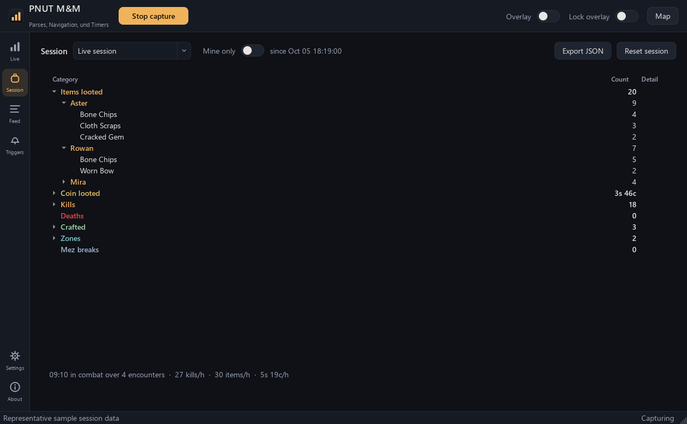
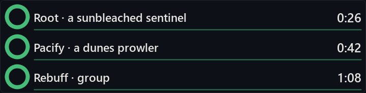
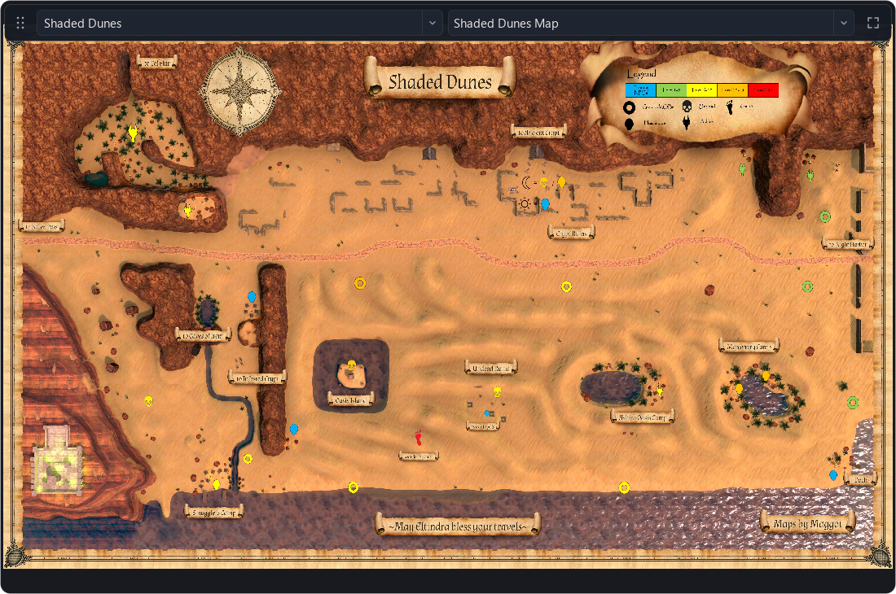

# PNUT M&M - Parses, Navigation, und Timers

A combat meter and session log for **Monsters & Memories**, a game that has no combat log
file. The app reads the in-game Combat chat window off the screen, turns it into an
EverQuest-style log and a stream of parsed events, and shows live DPS, healing, damage taken,
a crowd-control score, and session loot in a translucent overlay and a desktop window. It also provides configurable
trigger timers and a resizable map overlay that follows your current zone.

Do not talk about this tool in-game or use it to disparage or displace any other player. 


For maintainers: [development guide](docs/DEVELOPMENT.md) and [repository file audit](docs/FILE_AUDIT.md).

If you have any questions, or want to report people for being shitty with this tool, contact @Maergoth in discord. He doesn't use this, and has ways to deal with that.

## See PNUT in action

Actual app views with sample combat and timer data.

**Combat and session tracking.** Review encounters, damage, healing, crowd control, and loot.



<details>
<summary>See loot grouped by person</summary>

Expand each person's total to see their item breakdown.



</details>

**Timers in motion.** Countdown rings and bars change color as expiry approaches. This demo
runs at **4× speed**; timer colors and warning thresholds are customizable.



**Map overlay.** A compact header provides zone and map selectors, a drag grip when unlocked,
and fullscreen. The map follows zone changes and remembers its last state.



Map artwork: [Shaded Dunes Map, Monsters & Memories Wiki](https://monstersandmemories.miraheze.org/wiki/File:Shaded_Dunes_Map.jpg).

---

## User guide

### What it does, in one paragraph

Several times a second it captures the game window (Windows Graphics Capture, the same API OBS
uses for window capture), crops the Combat chat area, runs Windows' built-in OCR on it, works
out which lines are new as the text scrolls, writes them to a log file, parses each line into
an event (hit, miss, heal, kill, loot, crowd control, ...) and updates the meters. It never
touches the game process, memory, files or network traffic.

### Safety posture and the game's rules

Read this before using it.

- The tool is passive and out-of-process. It reads pixels only. It never opens the game
  process, reads memory, injects anything, hooks anything, sends keystrokes or mouse input, or
  sends messages to the game window. Game-window lookups use read-only Win32 calls
  (EnumWindows, GetWindowText, GetClassName, GetWindowRect, IsWindowVisible,
  GetWindowThreadProcessId). There is no network capture. From the game's point of view it is
  indistinguishable from a screenshot or an OBS window capture.
- The optional overlay is our own frameless, always-on-top window. It is shown without taking
  focus and never activates or raises itself over the game after that (WindowDoesNotAcceptFocus,
  so even clicking it does not take focus from the game). An optional click-through switch adds
  Qt.WindowTransparentForInput so it ignores the mouse entirely. It is still a window drawn
  above the game, which is a step up in visibility from a plain window; it is off by default.
- As of October 2026 the Monsters & Memories Master User Agreement
  (account2.monstersandmemories.com/policy/mau) forbids software that "intercepts, collects,
  reads, or 'mines' information generated or stored by the Platform" and any interception of the
  network protocol, and says the game may monitor your computer's memory for unauthorized
  programs. The Play Nice Policy bans automation and "extracting game data through unauthorized
  methods". Neither document names screen capture or OCR. This tool does nothing the agreement
  names explicitly, but the data-mining clause is broad enough that the developers could decide
  a screen-reading parser is unauthorized; Running it is your decision and your risk. Keep it private, do not
  discuss parses in game.

### Requirements

- Windows 10/11 with the English (United States) OCR language pack (Settings > Time & language
  > Language & region; present by default on an English install).
- The game running in borderless/windowed fullscreen (its default). Exclusive fullscreen cannot
  be captured per window.
- Python 3.14 only if you run from source; the downloaded app needs nothing else.

### Install and launch

**Download (recommended).** On the repository's
[Releases page](https://github.com/Maergoth/pnut-mnm/releases), download
`PNUT-MnM-<version>-windows.zip`, unzip it into a folder you can write to (for example
`Documents\PNUT M&M`, not `Program Files`), and run `PNUT M&M.exe`. The app is not
code-signed, so the first time Windows SmartScreen may say "Windows protected your PC": click
**More info**, then **Run anyway**. Capture starts by itself when the app opens (Settings >
"Start capture on launch" turns that off). Your settings (`config.json`), triggers
(`triggers.json`), logs and learned spellings (`logs\`) are created next to the exe and are never
part of a download.

**Names on each launch.** The Windows download starts the app under a freshly generated
executable name each time. Its main window, overlays and timer dialogs also receive random
window titles that stay consistent until you quit. Keep launching `PNUT M&M.exe`; shortcuts,
settings and the Update button continue to work. Older temporary executable copies are
cleaned up on later launches. Source runs randomize window titles but keep the Python process name.
This removes the usual fixed process/window labels; it does not make PNUT undetectable.
The launcher appears briefly, and its files, icon and other identifying information remain.

**App updates.** At the top of **Settings**, click **Update** to download the latest stable
Windows release from GitHub. When it is ready, click **Restart to update**. PNUT verifies the
download, replaces its application files, and keeps your configuration, triggers, logs and
map cache. The previous application files are retained in a backup folder for recovery.
The main window reopens after the update, keeping its saved size and maximized state.
**On startup** downloads updates automatically and offers a restart; it is unchecked by
default. Source checkouts are updated through Git instead. You can also download a newer ZIP
from Releases, close PNUT, and replace the executable and entire `_internal` folder manually.

**Updating from 0.1.0:** replace the entire `_internal` folder, or extract 0.1.1 or later
into a fresh folder. Merging files alone leaves an incompatible DLL from 0.1.0 behind and
can still cause the QtCore startup error. Preserve your `config.json`, `triggers.json`,
and `logs` when updating.

**From source.** With Python 3.14 installed:

```
python -m venv .venv
.venv\Scripts\python -m pip install -r requirements.txt
```

- **Desktop app:** double-click `PNUT M&M.cmd` (no console window). `make_shortcut.ps1`
  creates a desktop shortcut with the icon. `build_exe.ps1` builds the standalone
  `dist\PNUT M&M\PNUT M&M.exe` with PyInstaller (`pip install pyinstaller` first; about
  270 MB, a few minutes); when frozen, `config.json`, `cc.json`, `triggers.json` and `logs\`
  live next to the exe.
- The app never keeps a console window: started from a terminal it detaches from it, and
  the message stream lives on the Feed page with diagnostics in `logs\app.log`. Pass
  `--console` (or `-v`) to keep the console for debugging, and `--probe-stalls` to log what
  makes the overlay stutter (slow GUI events, garbage collections, the attack bar's frame
  timing).
- **Command line:** `.venv\Scripts\python -m mnmparse run` (console meter, no overlay),
  `snapshot` (one OCR pass), `calibrate` (crop picker), `parse FILE...` and `replay FIXTURE`
  (offline; several files given to `parse` are imported as one session). `run --seconds N`
  stops on its own after N seconds.

### Setting up the game window (do this once)

The better the text looks, the better the OCR.

1. Make **Combat** its own chat window. Put the combat channels in it (hits, misses, abilities,
   buffs, deaths), plus **Loot** and **Coin** if you want the Session tab to see loot. Keep Say,
   Party, Guild and the like out of it.
2. Set that window's opacity to **100%** (solid background) and use a readable font size. The
   default crop was tuned for roughly 20 to 26 px tall text.
3. Make it **wide enough** that long lines wrap instead of being cut off at the right edge. If
   you see lines like "... and you recei" followed by "skeletal warrior's corpse as your split",
   the game is clipping the line before it wraps; widen the window or nudge its size so the game
   re-wraps. No parser can recover text the game does not draw.
4. Keep roughly 12 or more lines visible. More visible lines means more chances to read each
   message before it scrolls away; a crop shorter than about 12 lines gets a one-time notice in
   the status bar.
5. Do not let other UI cover it. The character sheet opens over the top-left and covers the chat
   while it is open; turn off "auto-open character sheet on loot" or move the Combat window. The
   tracker detects the overlap and skips those frames, but lines that scroll past meanwhile are
   lost.
6. Open the app, go to **Settings > Crop**, press **Capture frame**, drag the rectangle over the
   chat text only (exclude the tab header), press **Test OCR** to confirm the lines read
   correctly, and **Save**. If you change OCR **Engine** or **Upscale**, stop and start capture
   after saving; Test OCR previews the edited settings immediately.

Which chat window is read is decided by that rectangle alone: the app captures the whole game
window as a picture and reads only the pixels inside the crop. Nothing is hooked. With two chat
windows, put the rectangle over the Combat one and keep the other window out of it. When you
move or resize the Combat window in the game, redo the crop. Messages the game copies into both
windows are read once, from the cropped one. Keep kill, loot, coin and zone messages in the
Combat window: the party roster, the Session tab and the zone headers come from them.

Only the game's own window is captured: one titled exactly "Monsters and Memories" (in any
case) whose window class is the Unity player's (`UnityWndClass`). A window whose title merely
contains the game's name is ignored, and a browser tab or a chat app (Firefox, Chrome, Edge,
Discord) is never captured, even with the exact title; such a window is noted once in
`logs\app.log` with its class and process id, and `app.log` names the title, class and process
id of the window capture starts on. Every 2 seconds a running capture checks that its window
still exists and is still the best match; if not, it stops and looks for the game again. With
the `mss` backend nothing is grabbed while the game window is gone.

### Using the app

The top bar has **Start/Stop capture** and switches for **Overlay** and **Lock overlay**.
Capture details (game window found, capture rate, OCR time, messages, covered frames,
unreadable lines, re-read lines skipped) are in the Status section in Settings. A
warning bar appears under the top bar, and a small one on the overlay, only when something
needs you: a game panel covering the Combat chat (lines scrolling by meanwhile are lost) or
messages that could not be fully parsed or needed an estimated amount. A successfully parsed
hit does not count as unreadable just because its final punctuation was missing. **Dismiss**
(or a click on the overlay's warning) hides it
until the problem has cleared and comes back. While the Combat chat is scrolled up (it does not
show its newest line) the overlay shows a "Chat scrolled up" note and the status bar says so
too; lines that arrive meanwhile are read once the chat shows its newest line again, with
times spread over the gap, and the open fight does not time out meanwhile (for up to two
minutes).

For troubleshooting, use **Settings > Status > OCR Diagnosis** to save a ZIP report.
It includes saved and edited settings, whether the crop is default or custom, the active
OCR configuration and language, capture statistics, recent unrecognized or incomplete
messages, and a fresh image of the Combat chat crop when the game is available. The report
also records screen size and DPI. Saving it does not upload or send anything. It includes
recent captured messages; lines that scrolled past without being captured cannot be recovered.

- **Live:** every encounter, grouped like Advanced Combat Tracker: one collapsible header per
  zone visit ("Night Harbor (West) · 61 encounters", time stamped with when you entered, the
  time spent in combat there and the damage done), newest first, with that visit's fights
  under it and the open fight pinned at the top (green dot). The newest visit is open; click a
  header's arrow (or double-click it) to open or close it. **Select a header for the summary
  of every fight in that visit** (all damage, healing, taken and utility added up; duration =
  time in combat; it keeps updating while you fight there). Select a fight for that fight. The
  view follows the newest fight until you pick something else. A zone change ends the open
  fight; fights from before the first zone line sit under "Unknown zone". **Reset encounter**
  closes the open fight; **Export CSV / JSON** writes the selection (a summary too) under
  `logs\exports\`. **Import log...** re-parses any `combat_*.log` or `events_*.jsonl` file
  (yours or a friend's) into the same tree, tagged with the file name; fights already listed
  (the same session imported twice, or a .log and its .jsonl) are skipped, and the file's
  session shows up in the Session page's source selector. Several files picked together are
  imported as one stretch of play: the party carries over from file to file, and when the app
  was restarted, the opening lines a log repeats from the one before it are left out. Fights
  that nobody in your group took part in (other groups nearby; the Combat chat shows them too)
  are hidden unless
  "Show other groups' fights" is on in Settings.
- **Session:** everything the group produced outside the damage numbers, for the whole run, as
  collapsible categories: items looted (one expandable subheader per person, showing the total
  number of items they looted, with item quantities beneath it), coin and your splits
  (a split line that wrapped onto a second row is joined to its loot), kills by mob type,
  deaths (yours and your party's; see "Encounters" below), crafted items (your party's only;
  other players' crafts are listed in the tooltip), quest rewards (kept out of the loot
  count), zones entered and mez breaks with timestamps ("X
  awakens." means a mesmerize broke), with time in combat (your group's fights only) and
  hourly rates. The party is the same roster the meter uses. Hovering a category
  or an item shows the detail. "Mine only" (and the overlay's self view) keeps just your own
  loot, coin, kills, deaths and crafts; there the coin row is "Coin received", what you
  actually got (your splits plus coin you looted alone), and coin per hour follows it, with the
  gross amount you looted as a detail. Coin is shown as platinum/gold/silver/copper with
  100 copper to a silver, 100 silver to a gold and 100 gold to a platinum. Export writes
  JSON under `logs\exports\`.
- **Feed:** every logged line, colored by kind, with filter chips and search.
- **Settings:** the Status section, player name, capture and OCR options, crop calibration,
  overlay defaults, encounter timeout ("Timeout without damage"), **Dummy Fix**, whether to
  count personal lines and whether to list other groups' fights.
- **About:** version, safety posture, terms.

The **overlay** has tabs Overview, Damage, Healing, Taken, Session and Feed. **Locked** means
it cannot be moved or resized; tabs, column sorting and hover breakdowns keep working. Unlocked
(top-bar switch or tray menu), a hover toolbar appears: drag the header to move, use the grip
to resize, set opacity and font size. **Click the header** to switch between the group table
and your own sources (damage by ability, healing by spell, damage taken by attacker, CC by
ability). A separate tray switch, "Overlay ignores mouse", makes the panel fully click-through
for people who want clicks to reach the game under it; tabs and tooltips stop working while it
is on. Everything persists between runs.

**Overlay hover cards.** Hover a number for its breakdown (DPS: damage by ability; HPS: healing
by spell; Utility: crowd control, debuffs and aggro; Taken: damage by attacker). Hover a name for
that row's breakdown for the selected tab and encounter: abilities on Damage, spells on
Healing, attackers on Taken, and a summary on Overview. Selecting a zone's "all fights" group
shows the same breakdown over that group's encounters. Name hovers also follow the tab in
your own sources view. Tooltips appear even while the game has focus.

**Earlier fights on the overlay.** Click the encounter name (it has a small arrow) for a list of
earlier fights grouped by zone, plus "all fights" per zone. Picking one shows it as if it had
just ended; the next fight replaces it, or pick "Live fight (follow)". The small people mark at
the right of the header switches between your group (two people) and just you (one person: your
own damage, healing and taken by source); clicking elsewhere on the header, or right-click >
"Show just you", does the same. The cursor shows the move arrows only while the overlay is
unlocked.

**Your group, outsiders and enemies.** The totals at the top (damage and DPS), the shares and the
clipboard line count only your group: you, your pet and your party. Everyone else in a fight is
one of two kinds:
- **Enemies**: anything named "a/an/the ...", plus anyone who hit your group or was hit by it,
  so named mobs ("Grandmaster Obadiah") and players attacking you in PvP count as enemies. They
  are drawn in the enemy colour and never counted. A fight is named after its enemies, so a
  PvP fight carries the attackers' names (never yours or your party's), and a heal that lands
  on an enemy is shown on its own, not as your group's healing.
- **Outsiders**: players on your side who are not in your party (another group fighting next
  to you; the Combat chat shows their fights too). They stay in the meter, faded and in
  italics, with "Not in your group" when you hover them, but are not counted in your totals.

The app learns your party from explicit chat evidence: "Your party member X has slain ..."
(or "has been slain by ..."), "X has joined the party.", "X is now the leader of the party.",
an invitation followed by "You have joined the party.", or a named coin loot with a split
paid to you. Ordinary loot, heals, corpse-drag permissions, and repeated nearby fights do not
add members. With no identified party, only you and your pets count toward group totals.
If capture starts midway through a group, right-click a member and choose **Count as my
group** until explicit party evidence arrives.

"X has left the party." and kicks remove automatic members. Joining a new party, leaving,
or disbanding clears the automatic roster; manual choices remain. Explicit members can be
restored across restarts when last seen within 6 hours (`logs/party.json`). Version 0.1.6
clears automatic membership learned by older versions because it may contain guesses;
manual choices and pet assignments are preserved. Newly identified members can update the
last 15 minutes of fights in the current zone visit without another clipboard copy.

**Show other groups' fights** filters whole encounters. Your self-buffs and self-heals during
nearby combat do not make those fights yours. Attacking, taking hits, healing an active
friendly combatant, landed crowd control, and pet combat count as participation. Nearby
players can still appear as faded outsiders within a fight that includes you; their damage
does not count toward your group's totals. Changing this setting updates the displayed
fight and encounter history immediately.

The chat seldom says whose pet a pet is. Right-click any combatant in the Live meter or
in the overlay and use **Assign pet to group member** to select yourself or a group member.
An attributed pet merges into its owner's parse: one row labeled **Owner + Owner's Pet**
shows their combined damage, healing, damage taken and utility. Multiple pets use **Owner +
Owner's Pets**. Pet abilities keep their pet's name in the breakdown, and group totals count
each contribution once. Copied summaries and CSV exports use the shorter **Owner+Pet**
label. Attributed pets follow their owner's group inclusion. Right-click
the combined owner row to reassign a pet or use
**Clear pet assignment** to remove its manual link. Assignments
are remembered across restarts and update the displayed encounters. The existing **Count as
my group**, **Don't count as my group**, and **Let the chat decide** controls remain available.

**Hit rates.** Your Combat chat shows your own misses and the enemies' misses on your group, but
not other players' misses ("X tries to hit Y, but misses!" never appears for them; only the
occasional dodge or parry does). Their Hit% would always read 100%, so it shows "—" instead,
with the reason in the tooltip. If your game's chat filter settings can show other players'
misses and you turn that on, the app notices the first such line and shows real hit rates.

**Auto-attack bar.** A thin swing timer sits under the overlay (Settings > Overlay > Auto-attack
bar). It learns your swing delay from the gaps between your own swings ("You crush ...",
including misses), so it needs a few swings first. The bar fills at that delay and waits at
full until the swing is actually read from the chat; only a read swing resets it, and it then
starts from the time already gone since the swing (the line reaches the app about a quarter
second late). A spell you cast holds your swing until the spell lands, which shows as a full bar
waiting. The delay only changes when a swing is read, never while the bar fills: it follows a
rolling estimate, and two swings in a row that agree but differ from it by more than 10% (a
haste buff starting or ending, a weapon swap) switch it at once. The
game writes the off hand and ranged shots out ("You slash X with your offhand", "with your
bow"), so the main hand, the off hand and the bow each get their own bar, in a fixed order.
Two weapons of different types without that wording get one bar per verb; only two same-type
weapons with no "offhand" in the lines are split into "hand 1" and "hand 2" by rhythm, a best
guess. Unlock the overlay to
drag the bar off it; drop it near the overlay's bottom edge, double-click it, or right-click >
Snap to overlay to dock it again; "Hide auto-attack bar" in that menu turns it off (Settings >
Overlay turns it back on). It follows the overlay's lock and click-through, sits above the
overlay when there is no room below, and "Reset position" brings it back too. The timing
is only as good as the chat timestamps (about a sixth of a second).

**Copy a fight to the clipboard.** When a fight your group took part in ends, a one-line
summary goes to the clipboard and a soft "dink" plays, ready to paste into a chat:

    a skeletal knight [0:48] 61.8 DPS - Maergoth 24.1, Brannoc 19.6, Tamsin 11.3, Wenna 6.8

The time and the rates in the line are your group's fighting time (from its first swing or hit
to its last), so a copy taken in the middle of a fight, or in the quiet seconds before it
closes, shows the same numbers as the copy made when it ends.

To copy by hand, click the copy mark at the right of the overlay's header (it turns into a check
mark), right-click the overlay, or right-click a fight or a zone header in the Live list (a zone
header copies the summary of that visit; right-clicking the meter side copies what it shows).
Settings > Export turns the automatic copy and the sound on or off and sets the format: pick a
preset (DPS, DPS and share, Damage, Healing, Everything) or edit the three templates, the line
(`{title} [{duration}] {dps} DPS - {actors}`), each person (`{name} {dps}`) and what goes
between people, plus the order and how many people. Line fields: `{title}`, `{zone}`,
`{duration}`, `{start}`, `{damage}`, `{dps}`, `{kills}`, `{killed}`, `{encounters}`,
`{actors}`; person fields: `{rank}`, `{name}`, `{dps}`, `{damage}`, `{share}` (% of the group's
damage), `{max}`, `{hit}` (hit %), `{hps}`, `{heal}`, `{taken}`, `{utility}`. A Python format spec
works too (`{dps:.0f}`). Enemies are never listed, and the result is always one line. The sound
uses the Triggers page's volume and output device.

**Triggers** (the bell in the left rail) react to chat text. **Timer/trigger help** above the
trigger list opens an offline, in-app walkthrough with a clickable table of contents,
variables, eight worked recipes, timer overlap rules, sharing, and troubleshooting.
Close it or press Escape to return to the editor. Each trigger has:
- **When the chat says**: the text to watch for, typed by hand or picked from suggestions
  (recently read chat lines and the names the app has learned). "Contains" (default), "Starts
  with", "Whole line" or a regular expression. Case, punctuation and spacing never matter, and
  "forgive OCR typos" lets each word be a letter off (four to six letters) or two off (seven
  to twelve); words of three letters or fewer must match exactly, so "bezins castinz
  Mesmerize" still matches. Paste
  a line into Test to check it.
- **Then**: nothing, one of eight built-in sounds, a sound file (.wav, .mp3, .ogg) or spoken
  text (Windows voices). Speech and display labels can use `{line}`, `{match}` and the named
  groups of a regular expression: `(?P<mob>an? [a-z ]+) is mesmerized` with "{mob} mezzed" says
  "a skeletal knight mezzed". "Quiet for" ignores repeats for a few seconds.
- **Label**: the text shown on the countdown for a timed trigger, or briefly below active
  timers for a trigger without a timer. Timed triggers do not also create a fading popup.
  Leave it blank to use the trigger name. Paste a sample chat line
  into **Test** to preview the filled-in label, or use **Fire this trigger now** to show it.
- **Timer** (optional): a countdown of any length on the overlay's timer panel, with what to do
  if it is already running: **Replace** starts the newly triggered timer and cancels obsolete
  queued speech; **Retain** ignores the overlapping trigger, including its sound or speech,
  and keeps the existing timer. **Add another** allows separate concurrent timers. Each trigger
  also has a warning N seconds before the end and an end alert (sound or speech).

To display Righteous Smite damage, set the trigger's **Match** to **Regular expression**,
its **Text** to:

```regex
Your Righteous Smite II hits .+? for (?P<damage>\d+) points of Holy Damage
```

Set **Label** to `Righteous Smite II: {damage} damage`. For a line ending in
`for 154 points of Holy Damage.`, the popup reads **Righteous Smite II: 154 damage**.
Use `III` in both fields for a separate rank III trigger, or remove ` II` for the base spell.
The named capture `(?P<damage>\d+)` supplies `{damage}`; matching only the spell name does
not capture a number. **Start a timer** can stay off when you only want the fading popup.

The bar at the top sets the volume, voice, speech rate and audio output for all triggers.
Triggers are saved as you edit them, in `triggers.json`. **Import timers…** accepts shared
JSON files and older `triggers.json` files, converting legacy overlap settings. Existing
timers stay intact; duplicates are skipped and conflicting versions are added as separate
copies. **Export timers…** lets you share the selected entry or all entries, including colors,
duration, speech and overlap settings. Global voice/output preferences stay local. Custom sound
files must be shared separately and selected on the recipient's computer.
For in-game sharing, select **one** trigger and choose **Export timers… > Selected timer for
game chat…**. Copy and paste the single code into a chat channel visible in the recipient's
capture area while PNUT is running. Each code contains exactly one trigger and preserves its
settings. Chat export is limited to 255 characters; unusually large definitions use JSON file
export instead, with no splitting or truncation. After the code is read and passes validation,
PNUT shows a **Review timer…** notice. The recipient can inspect it and choose **Import** or
**Dismiss**; nothing is imported or played automatically. If OCR misreads the code, resend the
share or use the JSON file instead. File export still supports a whole collection.
Use a clear chat font, such as Arial or Georgia. Some fonts, including Times New Roman, can
merge encoded characters; if a code is not detected, change the font or use JSON import.
Corrupted codes are rejected rather than imported with changed settings.
"Fire this trigger now" applies the trigger, including its overlap rule, without waiting
for the text. **Gatekick**, **Healkick**, and **Invis Break** are included on every install.
Invis Break matches **You begin to feel yourself appearing**. Version 0.1.6 corrects the old
default match once while preserving customized patterns, other settings, and deleted presets.
New installs use an immediate Falling sound with no Invis Break countdown or delayed alerts.
Version 0.1.9 removes the old default 30-second countdown once, preserving your chosen immediate
audio. Custom durations and delayed cues are left as configured. The usual fading trigger
notification still appears.
Healkick starts disabled, matching the original preset; enable it when wanted. Existing custom
triggers are preserved, and **Restore starter triggers** restores missing starters.

**Timer panel.** Trigger timers show in a panel docked under the overlay and above the
auto-attack bar: one row per timer with a ring that empties as time runs out, the label and a
minutes:seconds counter (hours:minutes:seconds past an hour). The ring is green, amber in the
warning period and red in the last five seconds by default; a finished timer flashes 0:00 for
a moment. Each trigger's timer editor lets you choose normal, warning, and low/ended colors,
as well as when the low-duration color begins.
Accepted triggers without a timer add a notification below the timer rows. Timed triggers
show only their countdown row. Notifications last four
seconds and fade during the final second; up to four recent notifications appear at once,
without displacing timer rows. "Quiet for" suppresses repeated non-timer notifications.
The panel appears while timers or notifications are active (right-click >
"Always show this panel" keeps it). Hiding the overlay also hides its notifications.
Right-click a timer to cancel it or all of them. Like the auto-attack bar it follows the
overlay, and with the overlay unlocked it can be dragged off and snapped back (drop it near the
overlay's bottom edge, double-click it, or right-click > Snap to overlay); the auto-attack bar
then docks under the overlay directly.

**Map overlay.** The separate always-on-top map opens by default on a fresh install. After
that, PNUT remembers whether you left it open or closed. Click **Map** in the top bar to
show or hide it. The selected zone and map, window size and position, fullscreen state,
zoom and pan are restored when you return.
The map uses the overlay's rounded frame, colors, opacity and font scale. Hover over its top
edge to reveal the single header with zone/map selectors and a fullscreen icon. Click the
arrow at the top left of the header to open the displayed zone's wiki page. The header
hides when you move away. Turn off **Lock overlay** to show the header's dotted drag handle;
drag that handle to move the window, or drag its edges to resize. Locking fixes the window's
position and size while zone selection, panning and zoom remain available. F11 fills the screen, and Escape
restores the window. Scroll to zoom and drag to pan. A recognized
"You have entered ..." or "Entering ..." line switches the map automatically. Keep zone
messages in the cropped Combat chat. You can also choose a zone manually and select another
map or floor when the wiki has several. Directional Night Harbor names use the same city map.

Maps come from the [Monsters & Memories Wiki](https://monstersandmemories.miraheze.org/wiki/Category:Zones).
Maps download when opened and are cached in `map_cache/` for offline use. At the top of
**Settings**, **Download latest maps** updates every known zone's maps in the background;
check **On startup** to do this automatically at launch (unchecked by default). The adjacent **wiki** link opens
the map source. Zones without a map show a clear message. An unavailable map never leaves the previous zone's image on
screen. Only public zone pages and images are requested; player names and combat logs are
never sent to the wiki.
To save space, place the map over the chat PNUT is logging. The default window capture (WGC)
reads the game underneath the map; desktop capture (mss) needs the chat to remain uncovered.

**Restarting does not log the chat twice.** The app saves what it has read
(`logs\tracker_state.json`) when capture stops and every 50 lines, and a restart within 10
minutes picks up from there, so only the lines that arrived in between are new. Lines already
on screen at a cold start (no saved state, or an older one) are not logged or counted: their
time is unknown and an earlier run may have logged them. A restart soon after a crash also
skips opening lines that repeat the end of the last log. The zone and the party carry over a
restart too.

**Settings > Overlay is live.** Opacity, font scale, tab, lock, click-through, the attack bar and
"Show overlay" apply as you change them, and follow changes made on the overlay itself (its
hover toolbar, the top-bar switches, the tray). The overlay remembers its state between runs.

**Narrow windows never clip text.** When the overlay or the main window gets narrow, the meter
hides its least important columns first (the rank number, then for example Hit%, share, Max)
and always keeps the name and the tab's main number; widen it again and they come back. The
overlay cannot be made narrower than its tab titles need at the chosen font size, the encounter
header moves its numbers onto a second line, zone tabs and feed filters wrap onto more lines,
and the actor details scroll instead of overlapping.

**Overview** shows per actor: DPS, HPS, **Utility** and damage **Taken**. Utility counts
crowd-control effects that landed (interrupts, stuns, mezzes, roots, silences, snares, fears,
charms, blinds; "pinned", "bound by a net shot" and "adheres to the ground" are roots, "slowed
by a snaring shot" is a snare), non-damage debuffs that landed (condemned, weakened,
resistance frayed, arcane defenses weakened, tormented, slowed movements, an irregular
heartbeat, drained vigor, chilled to the bone) and aggro (every taunt, plus "a skeletal warrior
looks angry at Wululiso"; the game never prints that line for the viewer, so your own taunts are
counted directly). An NPC's crowd control on players counts for that NPC; in PvP an archer's
Snaring Shot, Net Shot and Interrupting Shot are credited too, except when the target was
"temporarily IMMUNE" to it. A slam or kick that hits a
mob which was not casting interrupts nothing and earns no utility. Hovering a cell shows its
breakdown: the skill table under damage columns, spells under healing columns, attackers and
the damage prevented by blocks and absorbs under Taken, and every effect by type and by ability
under Utility. Tooltips need the mouse, so they work in the main window and in the overlay,
locked or not, but not while "Overlay ignores mouse" is on.

A named player action on a confirmed enemy defaults to **Utility** when it is not associated
with damage, even if the ability has no dedicated rule yet. Exposing Shot, Dispel Magic and
Purge are examples. The breakdown lists the action under its skill name. An explicit CC or
debuff result replaces that action's fallback credit, so the same action is not counted twice.
Failed, resisted or immune attempts, effect fades, chat and unidentifiable fragments do not
receive fallback credit. Cast announcements alone do not establish that an effect landed.
Bleed, profuse bleeding and Barbed Arrow announcements are **damage effects**, with no Utility
credit; their numbered damage ticks still count toward damage. This also corrects older
saved events that categorized Bleed as a debuff.

**Who caused an effect.** The game says "a dunes madman's casting is interrupted." or "a
skeletal fighter is condemned." without naming who did it, and it usually prints the effect
BEFORE the action that caused it ("...casting is interrupted." then "Famafenezo kicks a dunes
madman."). So each effect is matched to the closest attempt from three seconds before to two
seconds after it (or the next three lines when the capture timestamps jumped), with these
rules, checked against 733 effects read independently in the 2026-10-02 logs:
- an attempt aimed at someone else never counts; untargeted casts and area effects ("Fipuduzuleg
  smashes the ground around them") can count for any victim on the other side (players on mobs,
  mobs on players; a kick aimed at a player by name counts, for PvP);
- an interrupt needs an attempt after the victim began casting (a spell started earlier may
  still land after it); a stun on a caster (uppercut, an NPC's Bash or Slam) also interrupts;
- an ability named in the effect wins ("stunned by an electric arc" = Electric Arc, "an electric
  shock" = Electric Infusion); debuffs go to the likeliest named ability first (Distress for
  frayed resistance, Arcane Infusion for weakened arcane defenses, Interdiction for
  condemned, Omen of Enfeeblement or Exposing Shot for weakness), never to a plain melee swing;
- a cast or debuff in the few seconds before the first hit belongs to the fight it starts (a pull);
- an ability line too garbled to read the damage ("Gozif's Slice hits a for 3+oints") still
  identifies who used what (it never counts as damage).
The spell-school lockout line that follows an interrupt is not counted again.

The [October 10 log audit](docs/log-audit-2026-10-10.md) lists the latest damage, Utility,
loot and status categorization changes, with the remaining unreadable entries.

### Encounters

An encounter opens on the first swing (a heal alone does not open one, so out-of-combat heals
make no empty "encounters"; heals during the fight count) and ends only when nothing has been
hit or swung at for the timeout (Settings > Encounter), or at a zone change; it ends at its
last swing, so the wait does not count against the DPS. Kills are listed with the fight but
never end it: a chain pull is one fight unless there is a lull as long as the timeout, and the
clipboard copy comes that many seconds after the last swing. (Ending on kills made fights
end at once or drag on depending on whether the kill line was read cleanly and named every
enemy.) Stop capture closes the open encounter too. A fight in which nothing was damaged
(only misses or fully absorbed swings) is dropped. Keep the timeout at 8 seconds or more: a
shorter one cuts one fight into pieces because swings in this game can be more than four
seconds apart (a 4 s timeout turned the morning of 2026-10-02 into 621 fights, 206 of them a
second long; 12 s gives 261).

Mobs fighting each other (one NPC hitting another that is not your pet) never open a fight or
keep one going; inside a fight their swings are shown but not counted. A fight's duration, and
with it the DPS, HPS and damage-taken rates, runs from your group's first swing or hit to its
last, so other groups' swings and poison ticks after the last blow no longer stretch it (a fight
your group never swung in keeps its own span). The live timer still ticks while the fight is
open.

**Kills and deaths count your group only.** The Combat chat also shows other groups fighting
nearby. Your party is you plus the roster described under "Your group, outsiders and enemies"
above. An empty roster counts you alone, and ordinary loot does not add members.
"X has been slain by an a/an/the mob" is a death of X; a named mob such as
"Grandmaster Obadiah" killed by the party is a kill, not a death; "X has died." is what Feign
Death prints and is not a death. Deaths of players outside the group are listed separately and
not counted, and the same player dying twice within a minute is the same death read twice.

### What is deliberately not counted

Lines that only you receive about yourself (skill-ups, faction standing, experience ticks, PvP
opt-in, eating, loot from your own corpse, camping, harvesting, invites, tells, /who) are
classified as personal and left out of the Session tab unless you turn on "Count personal
lines" in Settings. The parser is about what the group can see. Vendor trades, NPC chat,
level-ups, quest rewards and /con text have kinds of their own: they show in the Feed and are
no longer counted as unreadable, but only quest rewards reach the Session tab (as rewards, not
loot).

### Known limitations

- OCR is good, not perfect. The parser repairs the common misreads (`1 1` for 11, also inside
  "(Block 1 1)", `D0ints` for points, a glued `ofHoly`, `slain bv`, dropped apostrophes even
  in "a grave mummys Strike", a final "!" read as "l" or "I", `WulDliso` for Wululiso, thrown
  weapons, a line cut off after its number); the rest stay in the log as unknown lines. Names,
  items, zones and abilities read one or two letters off ("Bone
  Ohips", "Night HarbOF (East)", "Dogabetarozem", "a eletal warrior") are shown as the spelling
  the chat uses most ("Bone Chips"); the app learns those spellings as you play (and from your
  old logs the first time) and keeps them in `logs\vocabulary.json`. Player and NPC names are
  learned from combat lines only (hits, heals, casts, kills, loot, crowd control and the like),
  so words such as "The" or a faction name never become names; entries that cannot be names
  are dropped from the file when it loads. Two real names one letter apart
  ("Tattered Rawhide Cap" and "...Cape") stay apart, and so do two well-known mobs whose names
  look alike ("a jackal" and "a jackal pup", "a skeletal fighter" and "a skeletal cleric").
- A row the OCR reads two different ways waits for a second identical reading before it is
  logged, so a one-frame misread loses to the consensus.
- Two messages the OCR ran together ("...for 2 points of Ho: a skeletal warrior's Strike hits
  YOU for 12 points of damage.") are split back into two, so the second one's damage is not
  credited to the first one's attacker; a first half that lost its end after the number
  ("...hits a skeletal fighter for 41") keeps its number. An ability name made of garbage is
  not counted at all.
- **Dummy Fix** (Settings > Encounter, off by default): a hit or heal whose number could not be
  read ("for $ points", "for points") counts as the current zone's average for the same
  attacker's same attack, else that attacker, else that attack, else every hit (or heal) in
  the zone. Nothing comparable read yet: the line is left out. Estimated numbers never become
  a "max hit", and the hover breakdown says how many numbers were estimated. A readable number
  with junk stuck to it ("for' 14 points") is always used as read. Your own logs from
  2026-10-02 had about 34 such lines in a day; most garbled lines have readable numbers but
  garbled words, which this does not touch.
- The best fix for garbled text is in the game: make the Combat chat window fully opaque with a
  dark background and keep other windows and panels off it.
- Scrolling the chat back (mouse wheel over it), or the chat re-drawing after a death or a zone
  change, shows old lines again; they are recognised and not logged twice. A burst of new lines
  counts as old content only when it sits right under an old line and goes on the way the
  history went after it, so a repeated group-spell block (Restorative Smite healing the whole
  party, twice in a row) is kept. When the chat window jumps, lines seen only once are held
  until the window lines up again, so a bad frame or something drawn over the chat creates no
  duplicates. Logs recorded before 2026-10-02 contain such repeats (one death showed up ten
  times); the importer removes them from those old logs only (no format header and started
  before 2026-10-02 16:44), and there only a screen that was clearly read in one go, so kills,
  "Stopped attacking.", party experience, group heals and procs that the game itself repeats
  are kept.
- Lines that scroll past between two frames are lost, and a line clipped by the game's own
  window edge is lost in part. More visible lines and a wider window both help.
- Wrapped messages are rejoined by word-level cues; an unusual wrap can still produce a split or
  a wrongly joined message. Coin splits take three lines and are handled: "..., and you
  receive" and "22 copper coins from X's corpse as your split." are joined, a split row read
  on its own is matched to its coin line, and a split whose denomination was clipped counts as
  copper.
- Crediting crowd control to its caster is a time-window heuristic, not a fact from the game.
  Intimidate/Intimidation is recognized as fear Utility when its user can be identified; an
  effect-only message with no visible user remains uncredited.
- The main window can open behind the fullscreen game because the app never steals focus;
  Alt-Tab to it.
